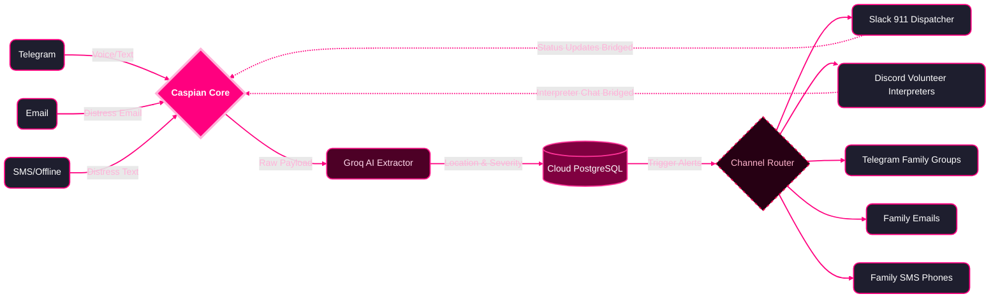

# SignalBridge

<div align="center">
  <strong>An Omnichannel, AI-Powered Emergency Relay for the Deaf and Hard-of-Hearing</strong><br>
  <em>Connecting Victims, Volunteers, and 911 Dispatchers across the platforms they already use.</em>
</div>
<br>

<div align="center">
  <a href="INSERT_DEMO_VIDEO_LINK_HERE"><strong>  Watch the Full Demo Video Here</strong></a>
</div>

---

## The Problem

Deaf and hard-of-hearing individuals often cannot use voice-based emergency services (like 911) effectively. Text-to-911 support exists in patches, but it is inconsistent, slow, and lacks the ability to seamlessly coordinate live interpretation support or reliably relay context-rich information (like exact location or severity) the way a live voice call does. 

Accessibility ideas often stop at "a chat interface for the deaf." **The true insight is coordinating a three-party real-time relay** (the victim, the dispatcher, and a volunteer interpreter) seamlessly across the specific platforms each party already uses.

---

##  The Solution & Architecture

SignalBridge is an intelligent triage platform that acts as a central hub. It uses ultra-fast LLMs to extract emergency contexts and instantly routes the data across multiple platforms simultaneously.



---

## Platform-by-Platform Integration

Because no single channel serves all three roles (Victims, Dispatchers, Interpreters), SignalBridge unifies them across 5 distinct mediums:
<br>
<div align="center">
  <table>
    <tr>
      <td align="center">
        <strong>Platform: Telegram</strong><br>
        
      </td>
      <td align="center">
        <strong>Platform: Slack</strong><br>
        
      </td>
      <td align="center">
        <strong>Platform: Discord</strong><br>
        
      </td>
      <td align="center">
        <strong>Platform: Email</strong><br>
        
      </td>
      <td align="center">
        <strong>Platform: SMS</strong><br>
        
      </td>
    </tr>
  </table>
</div>
<br>

### 1. The Victim (Intake via Telegram)
The person in distress messages the SignalBridge Telegram bot. They use a simple, accessible interface they already use daily. If no location is provided, the system initiates a 15-second countdown requesting a Google Maps link.
### 2. 911 Dispatchers (Slack Integration)
Emergency services require structured, formal, rich-data reporting. Our AI instantly formats the panic text into a clean Dispatch Card detailing coordinates, nature, and severity. The dispatcher can click a button to acknowledge the alert.
### 3. Volunteer Interpreters (Discord Bridge)
Specialized volunteers organize on community platforms like Discord. SignalBridge pings the volunteer channel requesting assistance. When a volunteer types `accept_relay:<id>`, SignalBridge establishes a **live, real-time two-way bridge** between Discord and the victim's Telegram.
### 4. Family Notifications (Email & SMS)
Family members linked to the victim's account instantly receive offline alerts containing the exact coordinates and severity of the emergency.

> **SMS Infrastructure Note (Hackathon Constraints)**: 
> SignalBridge features a robust, hybrid SMS architecture. Out of the box, we safely mock outbound SMS alerts in the terminal to avoid strict international telecom regulations (like India's TRAI/DLT) which block programmatic SMS to local numbers without extensive corporate KYC and registration. 
> 
> However, our codebase is strictly **production-ready**: simply provide `TWILIO_ACCOUNT_SID`, `TWILIO_AUTH_TOKEN`, and `TWILIO_PHONE_NUMBER` in the `.env` file, and the Caspian SDK will dynamically switch from the mock gateway to routing live, real-world SMS alerts.

---

## Technology Stack

* **Backend Core**: Python, FastAPI
* **AI & Triage**: Groq (LLaMA 3) for lightning-fast entity extraction and natural language processing.
* **Database**: SQLite & SQLAlchemy. We implemented a robust relational database schema (`database.py`, `models.py`) to persistently track User Profiles (linked family members), Emergency States (triage, dispatched, resolved), and active Relay Sessions bridging different platforms.
* **Omnichannel Communications**: [Caspian SDK](https://trycaspianai.com/)
  * Used for cross-platform webhook abstraction, allowing a single lightweight `bot_client.py` file to seamlessly handle Telegram, Slack, Discord, and Email routing simultaneously.

---

## Running Locally

### Prerequisites
1. Python 3.9+
2. A Telegram Bot Token (from BotFather)
3. A Caspian AI Developer Account

### Setup
1. Clone the repository and install dependencies:
   ```bash
   pip install -r requirements.txt
   ```
2. Configure your `.env` file:
   ```env
   GROQ_API_KEY=your_groq_key
   TELEGRAM_BOT_TOKEN=your_telegram_bot_token
   CASPIAN_API_KEY=your_caspian_comm_key
   
   # Optional: For Live Twilio SMS
   TWILIO_ACCOUNT_SID=
   TWILIO_AUTH_TOKEN=
   TWILIO_PHONE_NUMBER=
   ```
3. Run the backend server:
   ```bash
   uvicorn main:app --reload
   ```
4. Authenticate your platforms! The terminal will print OAuth links for Slack and Discord. Click them to authorize the Caspian Agent in your respective workspaces.
5. In your Slack and Discord channels, type a message to the bot. Copy the `conv_...` ID from your terminal logs and add them to your `.env`:
   ```env
   SLACK_DISPATCH_CHANNEL=conv_abc123
   DISCORD_VOLUNTEER_CHANNEL=conv_xyz987
   ```

---

## License and Copyrights

- **Core Application**: MIT License. See `LICENSE` for more information.
- **Third-Party Integrations**: 
  - This project integrates with Slack, Discord, Telegram, and Twilio via the **Caspian AI SDK**. All platform logos and trademarks are the property of their respective owners. 
  - Generative AI processing provided by Groq Inc.

<br>
<div align="center">
</div>
